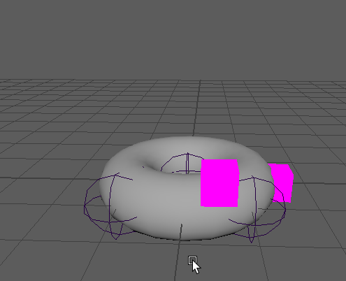

# skinTransforms
This is a proof of concept of a Transfer a skin cluster to transforms. 
THIS IS A BETA RELEASE USE AT YOUR OWN RISK

### Motivation

Sometime you want to have a transforms following a skinned mesh, all common contraints (follicle, geometry contraints, point on poly) ends adding the transform dependency to the mesh, 
making that mesh to miss GPU evaluation and optimization


### Posposal
Add a new nothe that carry the skinCluster weights and inputs but output a list of matrices to contraint transforms. Allowing to:
* compute outside the deformation stack, so all the mesh deformation doesnt needs to be evaluated to get the transform posiiton
* break the compute dependency to the mesh allowing all deformers compute on the GPU




# Using skintransfomrs.mll
## Before start

### Pre Compiled version

A precompiled Windows version for maya2019 is provided in the release folder.

### Compile you own version

Any external libreries are needed beside the Maya libraries dependencies

## Running instrucions
Creating a simple skinned scene as exmaple
```python
from maya import cmds
cmds.file(new=1,f=1)
#loading the plugin
cmds.loadPlugin(r'D:\dev\MayaNodes\skinTransforms\release\skinTransforms.mll')
#create a simple skinned mesh
joints = [cmds.joint(p=(1, 0, 1))]
joints.append(cmds.joint(p=(0, 0, 0)))
cmds.joint(joints[-1], e=1, zso=1, oj='xyz', sao='yup')
joints.append(cmds.joint(p=(1, 0, -1)))
cmds.joint(joints[-1], e=1, zso=1, oj='xyz', sao='yup')
mesh = cmds.polyTorus()[0]
skin = cmds.skinCluster(joints, mesh)[0]
#create the transforms to drive
positions = [(1.2, .5, -.5), (0,0,-1.5)]
for each in positions:
    cube = cmds.polyCube(w=.5, h=.5, d=.5)[0]
    cmds.polyColorPerVertex(cube, r=1, g=0, b=1, a=1, cdo=True)
    cmds.xform(cube, ws=1, t=each)

```
Having a skinned mesh and the transforms to drive you need to run 
```python
import sys
sys.path.append(r'D:\dev\MayaNodes\skinTransforms')
from pyutils import skinTransforms
skinTransforms.createSkinTansformNode('skinCluster1', ['pCube1', 'pCube2'])
```

## License

This project is licensed under the MIT License - see the [LICENSE](LICENSE) file for details

